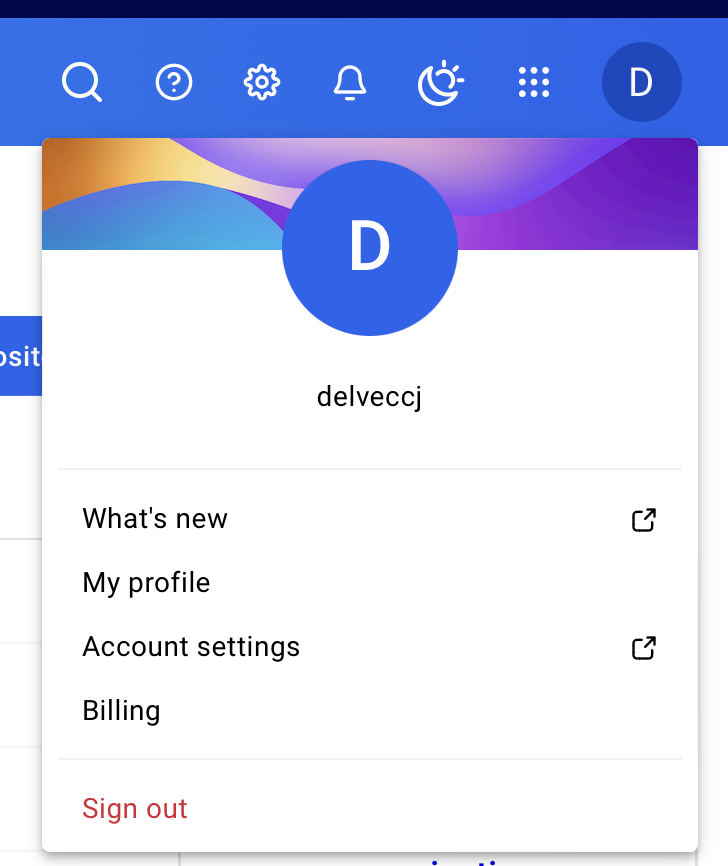
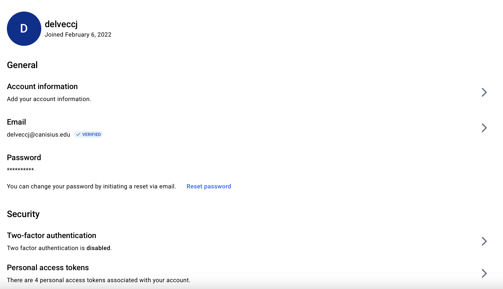
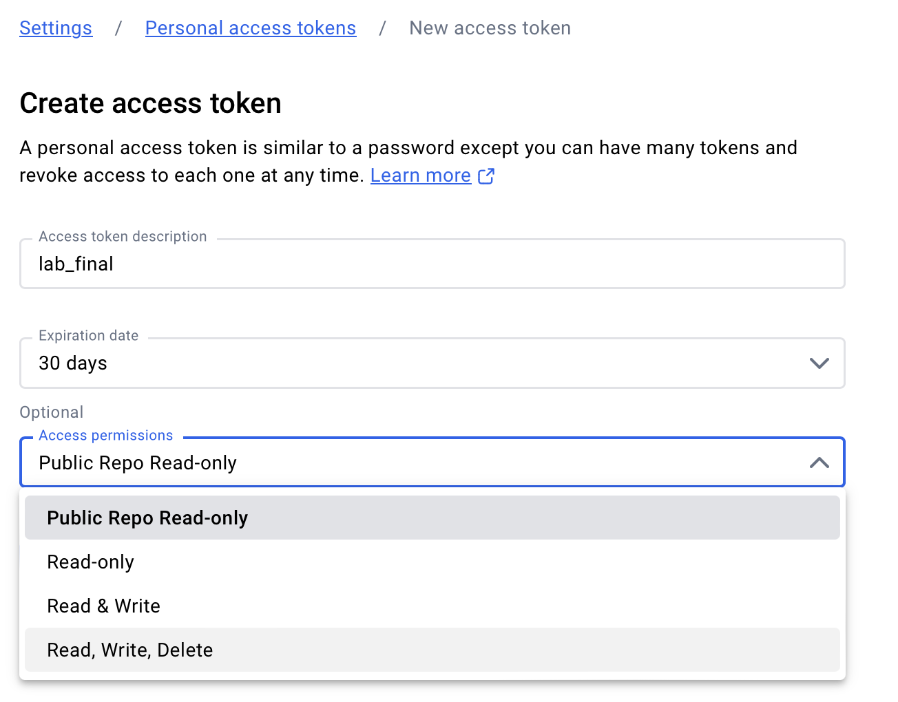
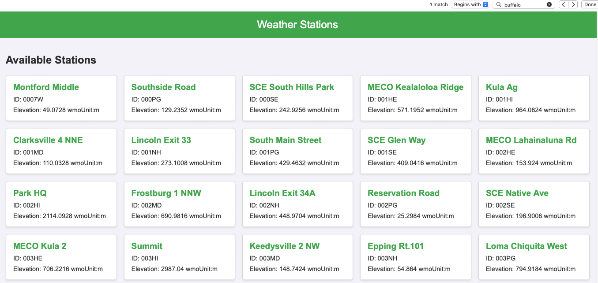
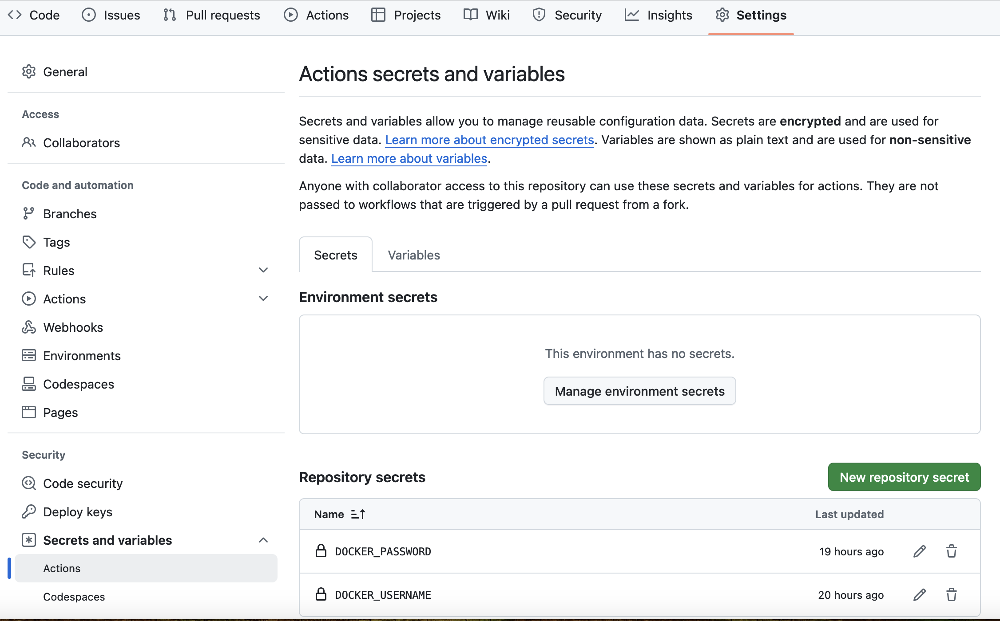

### **Dry-Run Lab Assignment: Building a Weather App**

#### **Overview**
In this lab, you will create a simple Weather Application that uses the Weather.gov API. The goal is to practice building a project from scratch with proper software engineering practices, including:
- Setting up a GitHub repository.
- Configuring a CI/CD pipeline.
- Dockerizing your application and pushing it to Docker Hub.
- Building a basic UI for user interaction.

By the end of this lab, you will have a working application framework that can be enhanced during the lab final.

You will perform this lab on the machines in the Cybersecurity lab.  You will use the Ubuntu partition.  You may ask the Bank for help with questions - but it will cost you points on the grade assigned.  

---
### **Commands for Issues Along the Way** ###
If you get an error realted to creating the virtual environment:

```bash
sudo apt update
sudo apt install python3.10-venv
```

If you get an error related to permissions for building or running Docker:
```bash
sudo usermod -aG docker $USER
```

### **Steps**

#### **1. Ensure You are Logged Into Github**

1. Login to the machine.  
2. Open Firefox and login to GitHub.
2. Open a terminal.
3. Type:

```bash
MC-28907:~ delveccj$ gh auth status
github.com
  ✓ Logged in to github.com account delveccj (keyring)
  - Active account: true
  - Git operations protocol: https
  - Token: gho_************************************
  - Token scopes: 'gist', 'read:org', 'repo', 'workflow'
```

If you are logged in and the account is active, then that is a good thing. If your active account is false or the token is invalid - then you need to login. You have done this before.  Do the following:

1.   Type:

```bash
MC-28907:~ delveccj$ gh auth login
? What account do you want to log into? GitHub.com
? What is your preferred protocol for Git operations on this host? HTTPS
? Authenticate Git with your GitHub credentials? Yes
? How would you like to authenticate GitHub CLI? Login with a web browser

! First copy your one-time code: 04B5-A62D
Press Enter to open github.com in your browser... 
```
Follow the directions from that point on!


#### **2. Ensure You are Logged Into DockerHub**

Login to Dockerhub.  Hopefully you remember your username and password!  

Once logged in - go to Account Settings.


From there, select Personal access token.  You are going to create one of these.


Create the token.  Be sure to select 'Read, Write, Delete'.  You need all three permissions.


Once the token is created, copy it into a file and save it!  You will need this later on.

#### **3. Set Up Your Repository**
1. Go to [GitHub](https://github.com/) and create a new private repository called ```weather-station-app```.  Invite your instructor to it as a collaborator.  The username to invite is:  delveccj
2. Be sure to add a README to the repo from github.  This will make life easier later on.
2. Clone the repository to your local machine.
3. Set up the following directory structure. Hint - some students were able to use ChatGPT to help them out with this task:

```
weather-station-app/
├── .github/
│   └── workflows/
│       └── ci.yml       # CI/CD workflow
├── app/
│   ├── templates/
│   │   └── index.html   # Main UI
│   ├── static/
│   │   └── style.css    # Optional CSS
│   ├── __init__.py      # Flask app initialization
│   ├── routes.py        # App routes
├── tests/
│   └── test_integration.py  # Integration test
├── Dockerfile            # Docker configuration
├── requirements.txt      # Python dependencies
├── README.md             # Project documentation
└── app.py                # Main application entry point
```

#### **2. Install Flask**
1. In the `requirements.txt` file, add:

```bash
Flask==2.1.3 
Werkzeug==2.1.2
requests==2.28.1
pytest==7.4.0
```
Note, these are probably the libraries you need but you might need something different based on the basic functionality you implement in the next step (Step 3).

Next you will crate a virtual environment in python.  Creating and activating a virtual environment in Python is simple! Here's how you can do it step by step:

Run the following command to create a virtual environment in your project directory:

```bash
python3.10 -m venv venv
```

- `venv` is the directory name where the virtual environment will be created. You can replace it with another name if you prefer (e.g., `env` or `.venv`).  Next, activate the virtual environment like so:

```bash
source venv/bin/activate
```

After activation, your terminal prompt should change to show the virtual environment's name, indicating it is active.

Example:
```bash
(venv) user@machine:~/project$
```

Once the virtual environment is activated, install the dependencies from your `requirements.txt` file:

```bash
pip3.10 install -r requirements.txt
```


When you're done working, you can deactivate the virtual environment by running the following command.  You do not need to do this until you are done with the lab assignment - and only if you want to:

```bash
deactivate
```

Your terminal prompt will return to its normal state.  You can do this after you want at the very end - but it is not necessary.

#### **3. Implement Basic Functionality**
1. Edit the file `routes.py` file with a Flask route that fetches weather alerts using the Weather.gov API.  You can copy and paste what you see below into that file.  You should study the API here - https://www.weather.gov/documentation/services-web-api - clicking on the Specification tab to understand what the service does:

   ```python
    from flask import Flask, render_template, jsonify
    import requests
    
    app = Flask(__name__)
    
    @app.route("/")
    def home():
        return render_template("index.html")
    
    @app.route("/stations")
    def stations():
        response = requests.get("https://api.weather.gov/stations")
        if response.status_code == 200:
            return jsonify(response.json())
        return {"error": "Failed to fetch data"}, response.status_code   
    ```

2. In `app.py`, initialize the app:


   ```python
   from app.routes import app

   if __name__ == "__main__":
       app.run(host="0.0.0.0", port=5000)
   ```

3. Edit the `index.html` file in the `templates/` directory and create a script that will fetch the stations and place them in a prettified HTML page.  Here is an example of what is meant by 'prettified' - the JSON list is turned into a visually appealing presentation.


You are free to use ChatGPT to help you out with the functionality!

6. You should now run the application.  At the command prompt run:

```bash
python3.10 app.py

``` 

---

#### **4. Dockerize the Application**
1. Create a `Dockerfile`:

   ```dockerfile
   FROM python:3.9-slim
   WORKDIR /app
   COPY requirements.txt .
   RUN pip install -r requirements.txt
   COPY . .
   CMD ["python", "app.py"]
   ```

2. Build and run your Docker container:

   ```bash
   docker build -t weather-app .
   docker run -p 5000:5000 weather-app
   ```

Once it is running, you can test it out to make sure it does what you expected!

#### **5. Add a CI/CD Workflow**
1. In `.github/workflows/ci.yml`, add the following.  Note - there is one item in here you will need to change.  You will need to figure out what:

```yaml
name: CI/CD Pipeline

on:
  push:
    branches:
      - main

jobs:
  build-and-deploy:
    runs-on: ubuntu-latest

    steps:
    - name: Checkout code
      uses: actions/checkout@v3

    # Set up Python
    - name: Set up Python
      uses: actions/setup-python@v4
      with:
        python-version: 3.9

    # Install dependencies
    - name: Install dependencies
      run: |
        pip install -r requirements.txt

    # Log in to Docker Hub
    - name: Log in to Docker Hub
      uses: docker/login-action@v2
      with:
        username: ${{ secrets.DOCKER_USERNAME }}
        password: ${{ secrets.DOCKER_PASSWORD }}

    # Build the Docker image
    - name: Build Docker image
      run: |
        docker build -t delveccj/dry-run:latest .

    # Push the Docker image
    - name: Push Docker image
      run: |
        docker push delveccj/dry-run:latest
```
Critically, you now need to head over to github.com, go to that repo, and add the action repository secret so that GitHub may push to Docker.  Remember that Dockerhub key you create - this is where you paste it.  You need to add the docker connectivity like so:




---

#### **7. Submission**


1. Add and commit your code from the command line.
2. Push your code to your GitHub repository.
2. Ensure the CI/CD workflow passes.  It will probably fail the first time - work your way through the messages!
3. Share your GitHub repository link with the instructor.
4. Demonstrate the working application in Docker.

---

### **Example Evaluation Criteria**
Point totals on final will probably be different than this.

1. **Repository Setup** (10 points): Proper structure, GitHub setup, and initial commit.
2. **API Integration** (20 points): Working alerts endpoint.
3. **Dockerization** (20 points): Successfully containerized application.
4. **CI/CD Workflow** (20 points): GitHub Actions workflow passes.
5. **UI Implementation** (30 points): Functional and user-friendly interface.

